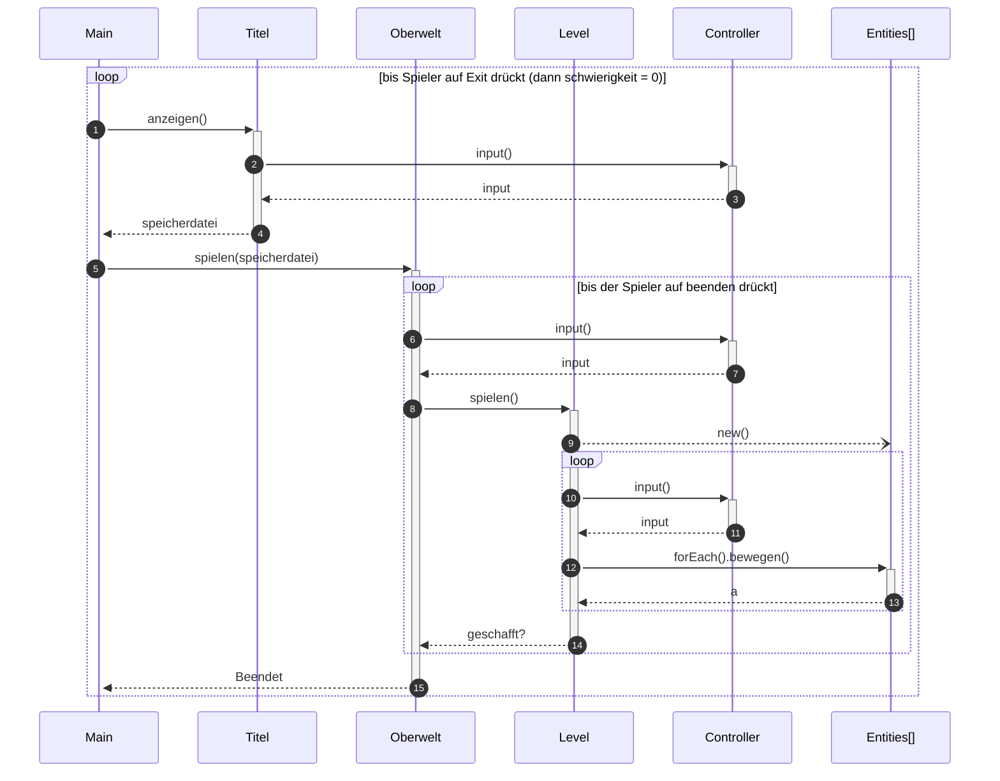
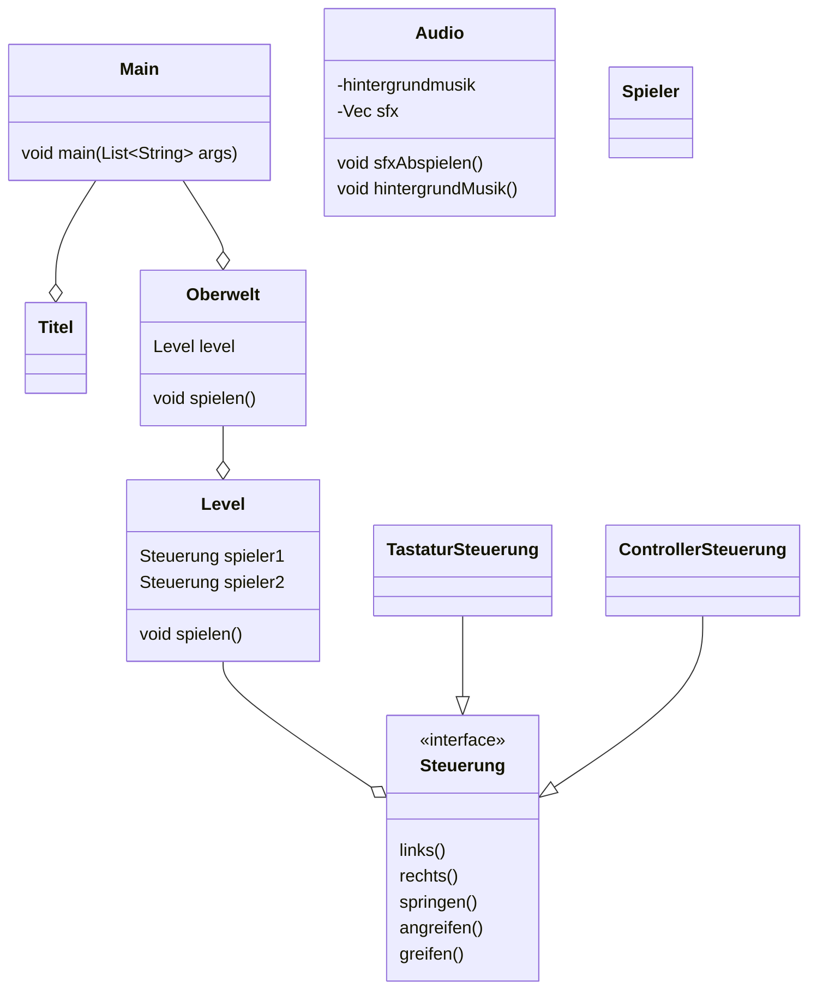

# Jump'n'run
mit Elementen von Grizzy und die Lemminge
## Features
(Features mit ? sind unsicher)
- DKC-ähnliche Steuerung
    - Springen
    - Rollen
        - Luftrolle
    - Bewegen
    - Greifen
    - Auf dem Boden Trommeln
- Lokaler Multiplayer?
- Speichern?
- Level von Datei laden
- Steuerung mit wasd, ijkl
- Levelauswahl-Bildschirmt
- Tutorial

## Ablauf

